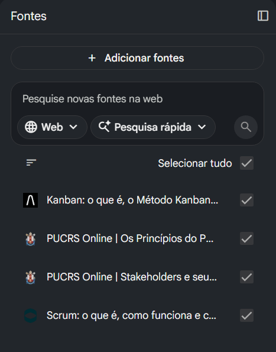
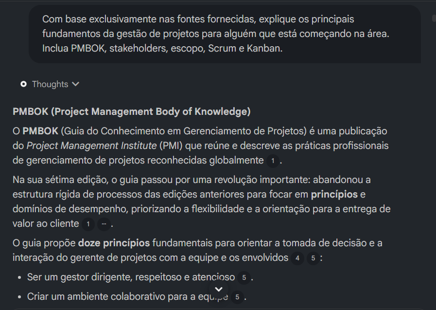

# Fundamentos de Gestão de Projetos com NotebookLM

Projeto de estudo utilizando o **NotebookLM** para consolidar conceitos fundamentais de **Gestão de Projetos**.

## Sobre o Projeto

Este projeto foi desenvolvido como parte de um desafio prático de utilização do NotebookLM como ferramenta de aprendizagem ativa.

O objetivo foi estudar conceitos fundamentais de Gestão de Projetos a partir de fontes selecionadas, utilizando diferentes prompts para:

* sintetizar conceitos;
* comparar abordagens;
* identificar limitações nas respostas;
* aplicar conhecimentos em situações práticas;
* criar um material de estudo reutilizável.

Além do aprendizado sobre Gestão de Projetos, o projeto também permitiu praticar a elaboração e o refinamento de prompts, analisando criticamente as respostas geradas pela Inteligência Artificial.

## Objetivos de Estudo

Os principais objetivos deste projeto foram:

* compreender os fundamentos do PMBOK e do PMI;
* entender o papel dos stakeholders em projetos;
* compreender conceitos relacionados ao escopo;
* estudar os fundamentos do Scrum;
* estudar os fundamentos do Kanban;
* comparar abordagens tradicionais e ágeis;
* aplicar conceitos de Gestão de Projetos em um cenário relacionado a dados e Power BI;
* avaliar criticamente respostas produzidas por Inteligência Artificial.

## Fontes Utilizadas

Foram utilizadas quatro fontes principais no NotebookLM:

* conteúdo sobre **Stakeholders e Escopo**;
* material sobre fundamentos do **PMBOK/PMI**;
* material introdutório sobre **Scrum**;
* material sobre **Kanban**.

As fontes serviram como base de conhecimento para os prompts e respostas gerados durante o estudo.

---

## Engenharia de Prompts e Aprendizados

### Prompt 1 — Visão Geral dos Fundamentos

**Prompt utilizado:**

> Com base exclusivamente nas fontes fornecidas, explique os principais fundamentos da gestão de projetos para alguém que está começando na área. Inclua PMBOK, stakeholders, escopo, Scrum e Kanban.

### Resultado

O NotebookLM apresentou uma explicação estruturada sobre os principais conceitos estudados, abordando:

* os princípios do PMBOK;
* o papel dos stakeholders;
* os conceitos e papéis do Scrum;
* os fundamentos e práticas do Kanban;
* uma visão inicial sobre escopo.

### Limitação encontrada

A explicação sobre escopo ficou superficial. O próprio NotebookLM informou que as fontes utilizadas não apresentavam conteúdo suficiente para desenvolver esse conceito de forma mais completa.

### Aprendizado

Esse primeiro teste mostrou que a qualidade das respostas do NotebookLM depende diretamente da qualidade e da abrangência das fontes fornecidas.

Mesmo utilizando um prompt claro, a IA não conseguiu aprofundar um tema que não estava suficientemente detalhado nas fontes.

Isso demonstrou que melhorar um resultado nem sempre depende apenas de escrever um prompt melhor. Em alguns casos, é necessário melhorar também a base de conhecimento utilizada pela IA.

---

### Prompt 2 — Comparação entre PMBOK, Scrum e Kanban

**Prompt utilizado:**

> Compare a abordagem tradicional de gestão de projetos apresentada pelo PMBOK com Scrum e Kanban. Mostre as principais diferenças, vantagens e situações em que cada abordagem pode ser mais adequada.

### Resultado

O NotebookLM apresentou uma comparação entre PMBOK, Scrum e Kanban, destacando diferenças relacionadas à estrutura, adaptação, fluxo de trabalho e aplicação prática.

Entre os principais pontos identificados:

* o PMBOK oferece princípios e uma estrutura ampla de gestão, permitindo abordagens tradicionais, ágeis e híbridas;
* o Scrum organiza o trabalho em ciclos curtos, chamados sprints, com papéis, eventos e artefatos definidos;
* o Kanban trabalha com fluxo contínuo, gestão visual das tarefas e limitação do trabalho em progresso (WIP);
* Scrum tende a ser adequado para projetos complexos e com mudanças frequentes;
* Kanban é especialmente útil para ambientes de trabalho contínuo;
* o PMBOK pode funcionar como referência ampla para gestão e governança.

### Ponto de Atenção

A resposta apresentou alguns dados quantitativos muito específicos, como percentuais de aumento de produtividade no Scrum e custos de implementação do Kanban.

Como esses números dependem diretamente das fontes utilizadas, seria necessário verificar sua origem e contexto antes de utilizá-los como conclusões gerais sobre essas abordagens.

### Aprendizado

Esse teste mostrou a importância de não avaliar uma resposta de IA apenas pela forma convincente como ela é apresentada.

Informações muito específicas, especialmente estatísticas e percentuais, precisam ser verificadas e contextualizadas.

Também ficou mais claro que PMBOK, Scrum e Kanban não precisam necessariamente ser vistos como abordagens concorrentes. Dependendo do contexto, diferentes práticas podem ser combinadas.

---

### Prompt 3 — Aplicação Prática em um Projeto de Power BI

**Prompt utilizado:**

> Imagine um projeto para desenvolver e implantar um dashboard de vendas em Power BI. Com base nas fontes, identifique o objetivo do projeto, escopo, principais stakeholders e como Scrum ou Kanban poderiam ser utilizados para organizar o trabalho.

### Resultado

O NotebookLM aplicou os conceitos estudados a um cenário prático de desenvolvimento de um dashboard de vendas em Power BI.

A resposta estruturou o projeto em quatro pontos principais:

* definição do objetivo, com foco na entrega de valor e apoio à tomada de decisão;
* definição inicial do escopo;
* identificação dos principais stakeholders;
* comparação de como Scrum e Kanban poderiam ser utilizados na organização do trabalho.

Na abordagem com Scrum, o trabalho foi organizado em sprints, utilizando backlog, Sprint Planning, Daily Scrum e Sprint Review.

Na abordagem com Kanban, o trabalho foi organizado em fluxo contínuo, utilizando um quadro visual, limites de WIP e métricas como Lead Time e Cycle Time.

### Aprendizado

Esse teste mostrou como conceitos teóricos de Gestão de Projetos podem ser utilizados em uma situação profissional concreta.

Também permitiu perceber que a escolha entre Scrum e Kanban depende da natureza do trabalho.

Scrum pode ser útil quando o desenvolvimento é organizado em ciclos e entregas incrementais.

Kanban pode ser especialmente adequado para ambientes em que existe um fluxo contínuo de demandas.

### Ponto de Atenção

Alguns elementos apresentados na resposta, como Jira, Trello, Azure e determinados papéis organizacionais, podem não estar descritos diretamente nas fontes utilizadas.

Isso mostrou a importância de diferenciar informações efetivamente presentes nas fontes de possíveis complementações realizadas pela IA.

---

### Prompt 4 — Erros na Definição de Escopo e Gestão de Stakeholders

**Prompt utilizado:**

> Quais são os principais erros que um profissional iniciante pode cometer ao definir escopo e gerenciar stakeholders? Explique como evitá-los com base nas fontes fornecidas.

### Resultado

O NotebookLM identificou erros comuns relacionados à definição de escopo e ao gerenciamento de stakeholders.

Na definição de escopo, os principais riscos apontados foram:

* iniciar a execução sem alinhamento claro sobre entregas, prioridades e objetivos;
* definir o trabalho de forma isolada, sem envolver a equipe responsável pela execução.

Na gestão de stakeholders, foram destacados problemas como:

* não identificar corretamente os stakeholders mais relevantes;
* não documentar decisões e alinhamentos;
* manter uma comunicação ineficiente ou tardia;
* reagir de forma defensiva a críticas e feedbacks.

Como medidas de prevenção, a resposta destacou práticas como:

* mapeamento de stakeholders;
* análise de influência;
* documentação de acordos;
* comunicação transparente;
* ciclos frequentes de feedback.

### Aprendizado

Esse teste mostrou que muitos problemas em projetos não estão necessariamente relacionados à execução técnica.

Falhas de comunicação, alinhamento e definição de expectativas também podem comprometer significativamente o resultado.

Também ficou evidente a importância de identificar quem possui maior influência sobre o projeto e manter essas pessoas adequadamente envolvidas.

### Ponto de Atenção

A resposta relacionou a definição de escopo diretamente ao Product Backlog e ao Product Owner do Scrum.

Apesar de esses elementos serem úteis em contextos ágeis, eles representam uma forma específica de organizar o trabalho e não devem ser tratados como a única forma de definir ou controlar o escopo de um projeto.

Isso reforçou a necessidade de diferenciar conceitos gerais de Gestão de Projetos de práticas específicas de determinados frameworks.

---

### Prompt 5 — Resumo Estruturado e Glossário

**Prompt utilizado:**

> Crie um resumo estruturado dos conceitos mais importantes presentes nas fontes e finalize com um glossário contendo pelo menos 10 termos essenciais de gestão de projetos.

### Resultado

O NotebookLM organizou os principais conceitos das fontes em quatro grandes temas:

* PMBOK;
* gestão de stakeholders;
* Scrum;
* Kanban.

Também foi criado um glossário contendo termos fundamentais de Gestão de Projetos, incluindo:

* PMBOK;
* Stakeholder;
* Stakeholder Chave;
* Mapeamento de Stakeholders;
* Scrum;
* Sprint;
* Product Backlog;
* Product Owner;
* Scrum Master;
* Kanban;
* WIP;
* Lead Time;
* Throughput.

### Aprendizado

Esse prompt foi útil para consolidar o conteúdo estudado e transformar informações distribuídas entre diferentes fontes em um único material organizado.

A construção do glossário também ajudou a identificar conceitos recorrentes e importantes para a compreensão de Gestão de Projetos e métodos ágeis.

### Ponto de Atenção

A resposta manteve alguns dados quantitativos específicos encontrados nas fontes, como percentuais elevados de aumento de produtividade associados ao Scrum.

Essas informações devem ser analisadas com cautela, pois resultados de produtividade podem variar significativamente conforme:

* equipe;
* contexto;
* maturidade;
* organização;
* tipo de projeto.

Além disso, alguns conceitos apresentados refletem especificamente as fontes selecionadas e não representam necessariamente todo o conhecimento existente sobre Gestão de Projetos.

---

# Miniguia de Gestão de Projetos

## PMBOK

O **PMBOK — Project Management Body of Knowledge** é uma referência desenvolvida pelo Project Management Institute (PMI) para organizar conhecimentos, práticas e princípios relacionados ao gerenciamento de projetos.

Nas versões mais recentes, existe maior foco em princípios, adaptação ao contexto e entrega de valor.

O PMBOK não deve ser entendido apenas como uma metodologia obrigatória, mas como uma referência que pode apoiar diferentes formas de gerenciar projetos.

## Stakeholders

**Stakeholders** são pessoas, grupos ou organizações que podem influenciar ou ser afetados por um projeto.

Alguns exemplos são:

* clientes;
* gestores;
* diretores;
* usuários;
* equipe do projeto;
* fornecedores;
* áreas internas da empresa.

Uma boa gestão de stakeholders envolve identificar quem são essas pessoas, entender seu nível de influência e interesse e estabelecer formas adequadas de comunicação.

## Escopo

O **escopo** define aquilo que faz parte do projeto e quais resultados devem ser entregues.

Uma definição clara de escopo ajuda a evitar:

* retrabalho;
* desalinhamento;
* expectativas diferentes entre os envolvidos;
* aumento descontrolado das demandas.

O escopo precisa estar relacionado aos objetivos e entregáveis do projeto.

## Scrum

O **Scrum** é um framework ágil utilizado principalmente para lidar com problemas complexos e ambientes em que mudanças podem acontecer com frequência.

O trabalho é organizado em períodos chamados **Sprints**.

Entre seus principais elementos estão:

* Product Owner;
* Scrum Master;
* equipe responsável pelo desenvolvimento;
* Product Backlog;
* Sprint Backlog;
* Sprint Planning;
* Daily Scrum;
* Sprint Review;
* Sprint Retrospective.

A ideia central é realizar entregas incrementais, obter feedback e adaptar continuamente o trabalho.

## Kanban

O **Kanban** é um método voltado para a visualização e melhoria contínua do fluxo de trabalho.

Um quadro Kanban pode ser organizado, por exemplo, nas etapas:

**To Do → Doing → Done**

Um de seus conceitos mais importantes é o limite de **WIP — Work in Progress**, que evita que muitas atividades sejam iniciadas simultaneamente.

O objetivo é melhorar o fluxo e incentivar a conclusão das atividades antes do início de novas demandas.

## Scrum x Kanban

Scrum e Kanban possuem características diferentes.

O **Scrum** tende a organizar o trabalho em ciclos definidos e entregas incrementais.

O **Kanban** trabalha com um fluxo mais contínuo de atividades.

A escolha depende do tipo de trabalho, da equipe, da organização e das características do projeto.

Também é possível utilizar práticas de diferentes abordagens de maneira combinada.

## Aplicação em um Projeto de Power BI

Em um projeto para desenvolvimento de um dashboard de vendas em Power BI, conceitos de Gestão de Projetos podem ajudar a organizar diferentes etapas.

Por exemplo:

**Objetivo:** disponibilizar informações comerciais de forma visual para apoiar decisões.

**Stakeholders:** gestores comerciais, usuários do dashboard, equipe de dados, TI e patrocinadores.

**Escopo:** obtenção dos dados, tratamento, modelagem, criação das métricas, desenvolvimento dos visuais, validação e implantação.

**Scrum:** pode organizar o desenvolvimento em ciclos, com entregas progressivas do dashboard.

**Kanban:** pode organizar as tarefas em um fluxo visual, permitindo acompanhar o andamento e identificar gargalos.

---

# Glossário

**PMI:** Project Management Institute, organização internacional relacionada à área de gerenciamento de projetos.

**PMBOK:** conjunto de conhecimentos, princípios e práticas de gerenciamento de projetos publicado pelo PMI.

**Stakeholder:** pessoa, grupo ou organização que pode influenciar ou ser impactada por um projeto.

**Stakeholder Chave:** stakeholder que possui influência significativa sobre decisões ou resultados do projeto.

**Escopo:** definição do trabalho e das entregas que fazem parte do projeto.

**Scrum:** framework ágil baseado em ciclos curtos, colaboração, inspeção e adaptação.

**Sprint:** período de duração definida utilizado para organizar o trabalho no Scrum.

**Product Owner:** papel do Scrum responsável por maximizar o valor do produto e gerenciar prioridades relacionadas ao Product Backlog.

**Scrum Master:** papel responsável por apoiar a aplicação do Scrum e ajudar a equipe a remover impedimentos.

**Product Backlog:** lista ordenada de itens, necessidades e melhorias relacionadas ao produto.

**Kanban:** método de gerenciamento visual e melhoria contínua do fluxo de trabalho.

**WIP — Work in Progress:** quantidade de atividades que estão sendo executadas ao mesmo tempo.

**Lead Time:** tempo total entre o início do fluxo de uma demanda e sua conclusão.

**Cycle Time:** tempo utilizado efetivamente para executar determinada atividade ou etapa.

**Throughput:** quantidade de itens concluídos em determinado período.

---

# Principais Aprendizados com o NotebookLM

A utilização do NotebookLM mostrou que uma ferramenta de Inteligência Artificial pode contribuir significativamente para o processo de aprendizagem, principalmente na organização e síntese de diferentes fontes.

Entretanto, alguns cuidados ficaram evidentes durante os testes.

### 1. A qualidade das fontes influencia diretamente a resposta

Quando determinado assunto não estava bem representado nas fontes, como ocorreu inicialmente com o conceito de escopo, a resposta também apresentou limitações.

### 2. Um bom prompt melhora a qualidade da análise

Perguntas mais específicas produziram respostas mais úteis do que solicitações muito amplas.

Prompts que pediam comparação, aplicação prática e identificação de problemas produziram resultados especialmente interessantes.

### 3. Respostas de IA precisam ser analisadas criticamente

Mesmo quando uma resposta parece bem estruturada, determinados dados podem exigir validação adicional.

Isso ficou evidente principalmente em estatísticas e percentuais muito específicos apresentados em algumas respostas.

### 4. A IA pode complementar informações além das fontes

Em alguns exemplos, o NotebookLM apresentou ferramentas ou conceitos que poderiam não estar explicitamente presentes nas fontes.

Por isso, é importante verificar se determinada afirmação realmente está fundamentada no material fornecido.

### 5. Prompts podem ser reutilizados

Uma das principais conclusões do projeto foi que bons prompts podem se transformar em modelos reutilizáveis para estudar outros assuntos.

---

# Prompts Reutilizáveis

Alguns dos prompts utilizados neste projeto podem ser adaptados para diferentes temas de estudo.

### Para aprender um novo assunto

> Com base exclusivamente nas fontes fornecidas, explique os principais conceitos sobre [TEMA] para alguém que está começando na área.

### Para comparar conceitos

> Compare [CONCEITO A] e [CONCEITO B]. Apresente as principais diferenças, vantagens, limitações e situações em que cada um é mais adequado.

### Para aplicação prática

> Crie um exemplo prático de aplicação dos conceitos apresentados nas fontes em um projeto relacionado a [CONTEXTO].

### Para identificar erros

> Quais são os principais erros que um profissional iniciante pode cometer em relação a [TEMA]? Explique como evitá-los com base nas fontes fornecidas.

### Para consolidar o estudo

> Crie um resumo estruturado dos principais conceitos presentes nas fontes e finalize com um glossário dos termos essenciais.

### Para controlar informações externas

> Responda utilizando exclusivamente informações presentes nas fontes fornecidas. Quando uma informação não estiver disponível nas fontes, informe explicitamente essa limitação em vez de complementar a resposta com conhecimento externo.

# Evidências do Projeto

## Fontes utilizadas no NotebookLM

Abaixo estão as fontes adicionadas ao NotebookLM para construção do estudo:

## Exemplo de Prompt e Resultado

Exemplo de interação realizada durante o desenvolvimento do projeto:

---

# Conclusão

O projeto permitiu utilizar o NotebookLM não apenas como uma ferramenta para obter respostas, mas como apoio estruturado ao processo de aprendizagem.

A realização de diferentes testes mostrou a importância de selecionar boas fontes, elaborar prompts claros e analisar criticamente os resultados apresentados pela Inteligência Artificial.

Além de consolidar conceitos fundamentais de Gestão de Projetos, o exercício ajudou a desenvolver habilidades relacionadas à engenharia de prompts, validação de informações e aplicação prática do conhecimento.

O principal aprendizado foi que a Inteligência Artificial pode acelerar o processo de estudo, mas a qualidade do resultado depende da combinação entre **boas fontes, bons prompts e análise crítica do usuário**.
